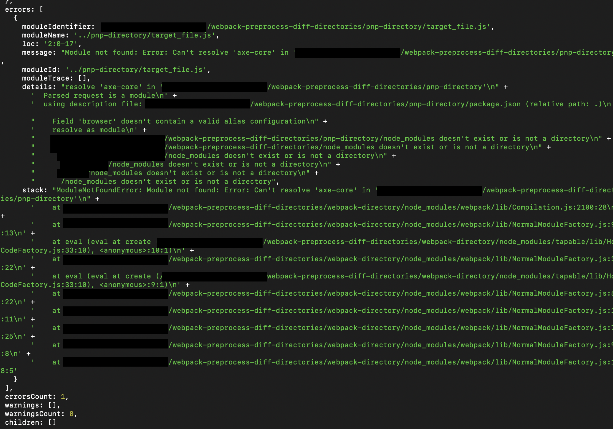

# Webpack Preprocess different directories with different package managers

## Installation

make sure you are using Node 20 or a recent version of node.

### pnp-directory

`cd` into the `pnp-directory` and make yarn `4.1.1` is installed and being used. This can be enabled by using:

```sh
cd pnp-directory
corepack enable
yarn set version 4.1.1
```

Then, install the dependencies in the repository. No `node_modules` should be present. See [plug and play documentation](https://yarnpkg.com/features/pnp) for more details.

There is a file, called `target_file.js` that includes an import from `axe-core`, which is installed in the repository via `pnp` and lives in the `pnp` virtual file system. This file is going to be compiled by webpack in the `~./webpack-directory` repository.

### webpack-directory

`cd` into the `webpack-directory` and install the dependencies via `npm install`. This repository does NOt use `yarn PnP`.

## Reproduction

To reproduce, run the `npm run compile` script from the `webpack-directory`. This will run the `webpack` compiler from the node context with a very simple config/options to compile the `target_file` found in the `pnp-directory`. Notice the error

```sh
"Module not found: Error: Can't resolve 'axe-core' in ...
```

 It appears the webpack process is trying to resolve dependencies using the traditional `node_modules` approach and not discovering the dependencies that are installed in the compilation directory that are installed via `yarn PnP`.

 My expectation is that pnp would be detected here, or there is a way to pass the `pnpapi` programmatically to webpack in order to inform webpack to compile the file with the correct `yarn PnP` API instance.

